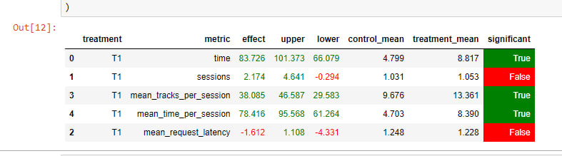

### Идея

Исправим один из недостатков Contextual реккомендера, 
а именно то, что рекомендации ищутся по последнему прослушанному треку,
который может оказаться не так хорош. Поэтому возьмем k пердыдущих прослушанный треков,
порекомендованных только от начального, возьмем из них лучший по скору и начнем рекомендовать от него.
Очистим накопленный пулл для выбору базового трека, и начнем по новой

### Реализация

Заведем 2 мапы (для большего количества юзеров так конечно не получится, это должны будут быть редис бдшки)
Первая будет отвечать за накопленный пулл песен, вторая за текущий базовый трек. В самом начале Пулл пустой,
а базовым треком является изначально прослушанный. Как только треков копится больше 10, выбираем из них новый
базовый. На данный момент берется просто лучший по скору. Пулл очищается.

Для улучшения есть несколько направлений
1. сделать не мапу, а отдельную редис бд, так как количество юзеров может быть больше
2. Возможно повторение опорных треков

Но уже и с такой супер простой реализацией есть существенный прирост метрики

### Код

Рекоммендер в better.py
server.py и experiment.py изменены для запуска AB эксперимента

### Запуск

run.py --episodes 1000 --config config/env.yml single --recommender remote --seed 2281337

#Итог
Улучшение среднего времени в сессии на 78%
Ухудшение времени отклика :(
